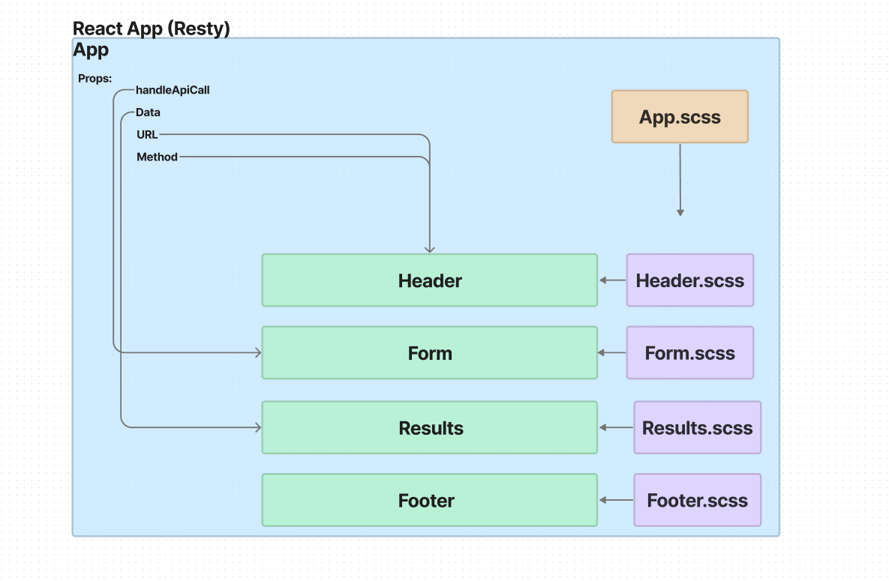
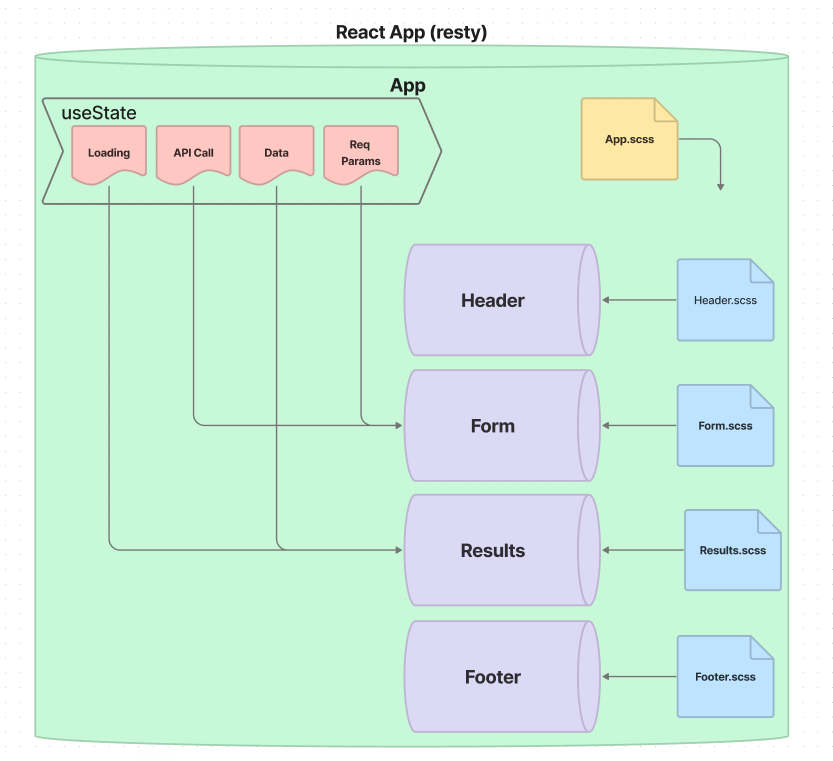
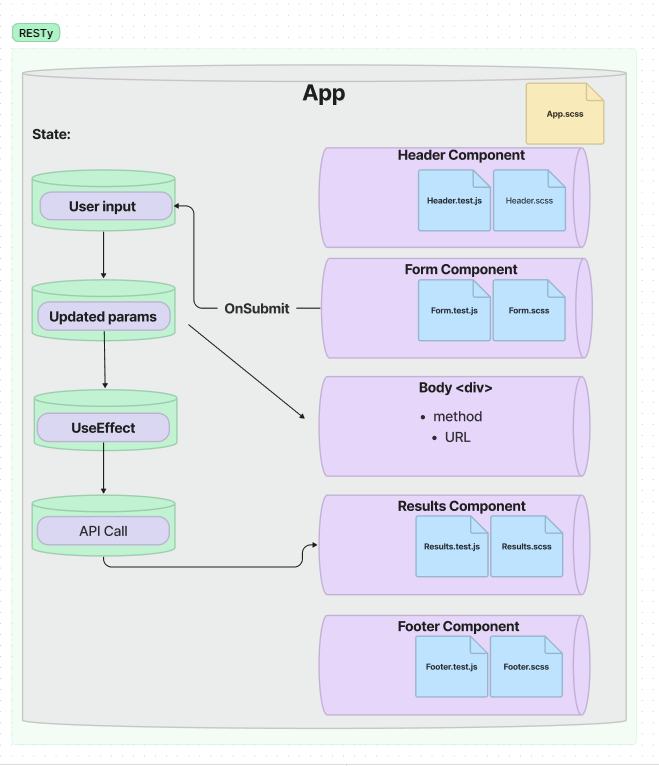

# **Resty**

## **Lab 26**

Author: Justin Mathieu

## **Running the App**

- npm start
- On click of 'Go' button fake results will be rendered.

## **Tests**

Lab 26

- No Tests yet.

Lab 27

- Still need to work on testing, But got a few to pass.

## **Links**

[Code Pen Lab 26](https://codesandbox.io/p/github/Justin-Mathieu/Resty/main?file=%2Fsrc%2FComponents%2FHeader%2Findex.jsx%3A1%2C1&layout=%257B%2522sidebarPanel%2522%253A%2522EXPLORER%2522%252C%2522rootPanelGroup%2522%253A%257B%2522direction%2522%253A%2522horizontal%2522%252C%2522type%2522%253A%2522PANEL_GROUP%2522%252C%2522id%2522%253A%2522ROOT_LAYOUT%2522%252C%2522panels%2522%253A%255B%257B%2522type%2522%253A%2522PANEL_GROUP%2522%252C%2522direction%2522%253A%2522horizontal%2522%252C%2522id%2522%253A%2522EDITOR%2522%252C%2522panels%2522%253A%255B%257B%2522type%2522%253A%2522PANEL_GROUP%2522%252C%2522direction%2522%253A%2522vertical%2522%252C%2522id%2522%253A%2522clj4xidkl00ef356myvplrlwy%2522%252C%2522panels%2522%253A%255B%257B%2522type%2522%253A%2522PANEL%2522%252C%2522panelType%2522%253A%2522TABS%2522%252C%2522id%2522%253A%2522clj4xmgkw01ib356mzzhidrk4%2522%257D%252C%257B%2522type%2522%253A%2522PANEL%2522%252C%2522panelType%2522%253A%2522TABS%2522%252C%2522id%2522%253A%2522clj4xmgkw01ia356mosvkta83%2522%257D%255D%252C%2522sizes%2522%253A%255B50%252C50%255D%257D%255D%252C%2522sizes%2522%253A%255B100%255D%257D%252C%257B%2522type%2522%253A%2522PANEL_GROUP%2522%252C%2522direction%2522%253A%2522horizontal%2522%252C%2522id%2522%253A%2522DEVTOOLS%2522%252C%2522panels%2522%253A%255B%257B%2522type%2522%253A%2522PANEL%2522%252C%2522panelType%2522%253A%2522TABS%2522%252C%2522id%2522%253A%2522clj4xidkl00eg356mjdooqjth%2522%257D%255D%252C%2522sizes%2522%253A%255B100%255D%257D%255D%252C%2522sizes%2522%253A%255B57.12531517076525%252C42.87468482923475%255D%257D%252C%2522tabbedPanels%2522%253A%257B%2522clj4xmgkw01ib356mzzhidrk4%2522%253A%257B%2522id%2522%253A%2522clj4xmgkw01ib356mzzhidrk4%2522%252C%2522activeTabId%2522%253A%2522clj4xqazo00fy356mgr5chh8v%2522%252C%2522tabs%2522%253A%255B%257B%2522type%2522%253A%2522FILE%2522%252C%2522filepath%2522%253A%2522%252Fsrc%252FComponents%252FHeader%252Findex.jsx%2522%252C%2522id%2522%253A%2522clj4xqazo00fy356mgr5chh8v%2522%252C%2522mode%2522%253A%2522temporary%2522%252C%2522state%2522%253A%2522IDLE%2522%257D%255D%257D%252C%2522clj4xidkl00eg356mjdooqjth%2522%253A%257B%2522id%2522%253A%2522clj4xidkl00eg356mjdooqjth%2522%252C%2522activeTabId%2522%253A%2522clj4xo16h00cp356mrtbdrcuj%2522%252C%2522tabs%2522%253A%255B%257B%2522id%2522%253A%2522clj4xo16h00cp356mrtbdrcuj%2522%252C%2522mode%2522%253A%2522permanent%2522%252C%2522type%2522%253A%2522TASK_LOG%2522%252C%2522taskId%2522%253A%2522build%2522%257D%252C%257B%2522type%2522%253A%2522TASK_LOG%2522%252C%2522taskId%2522%253A%2522start%2522%252C%2522id%2522%253A%2522clj4xotng0079356mjb35ti8n%2522%252C%2522mode%2522%253A%2522permanent%2522%257D%252C%257B%2522type%2522%253A%2522TASK_PORT%2522%252C%2522taskId%2522%253A%2522start%2522%252C%2522port%2522%253A3000%252C%2522id%2522%253A%2522clj4xowxn00ci356mpyegwb9g%2522%252C%2522mode%2522%253A%2522permanent%2522%252C%2522path%2522%253A%2522%2522%257D%255D%257D%252C%2522clj4xmgkw01ia356mosvkta83%2522%253A%257B%2522id%2522%253A%2522clj4xmgkw01ia356mosvkta83%2522%252C%2522tabs%2522%253A%255B%255D%257D%257D%252C%2522showDevtools%2522%253Atrue%252C%2522showSidebar%2522%253Atrue%252C%2522sidebarPanelSize%2522%253A10%257D)

## **UML**

### Lab 26

### Lab 27

## Lab 28

